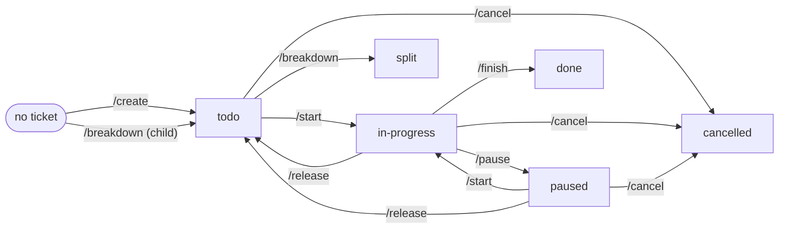

# Backlog Management

How work items are created, moved, and tracked. Every unit of work (features, chores, bugs, findings) is a
backlog item, and its status is changed only by commands, never by hand.

---

## 1. Core principles

- **One source of truth.** Each ticket has exactly one authoritative copy. No mirrors, no per-branch copies.
- **Status is one field.** Never a folder, never inferred from branch state, never derived from another ticket.
- **Commands are the only writers.** Humans never hand-edit metadata fields. `Comments` is append-only.
- **Every way work can end has a command:** `/finish` (delivered), `/cancel` (abandoned), `/breakdown`
  (decomposed). There is no fourth way.
- **Effort is recorded as work intervals,** not as a single start date.
- **Every write is visible team-wide immediately.**

---

## 2. Where the backlog lives

Pick one, and only one:

| Option | Source of truth | Best when |
| --- | --- | --- |
| In-repo | Markdown tickets in `docs/backlog/<scope>/tasks/` on a long-lived, unprotected, never-merged `backlog` branch | Agent-native teams, reviewable git history, no external dependency |
| External tracker | Jira / Linear / GitHub Issues, driven via its native API under a service account | Org-wide visibility, PM tooling |

In-repo: every command reads and writes the ticket **on the `backlog` branch**, from whatever branch you are
on. The ticket never travels on a feature branch.

### Scopes

- The backlog is split into scopes: `docs/backlog/<scope>/tasks/` (+ `images/`). The folder *is* the scope.
  Creating one is `mkdir`.
- Scope names: no whitespace, no special characters, **no `-`** (use `_`, e.g. `scope_1`).
- Scopes are discovered at run time by listing `docs/backlog/*/`. Never hardcode a scope name.
- Create the first scope when you set up the backlog, so the first `/create` works without asking.

### IDs

- Format: `<scope>-<type>-<NNNN>`, e.g. `scope_1-task-0001`.
- One counter per scope, shared by `task` and `bug`, zero-padded from `0001`.
- The ID is derived (highest existing number + 1), never stored in a counter file.
- The scope is part of the ID, so it is immutable. Items never move between scopes.
- File name: `<ID>-<title-slug>.md`. The feature branch for the item is named `<ID>`.

---

## 3. Statuses

Six statuses, no flags:

| Status | Meaning |
| --- | --- |
| `todo` | In the queue. Unassigned `todo` = anyone may pick it up |
| `in-progress` | Being worked on (exactly one open work interval) |
| `paused` | Put down with a reason, not ended |
| `done` | Delivered (terminal) |
| `cancelled` | Abandoned, with a reason (terminal) |
| `split` | Replaced by its own children via `/breakdown` (terminal) |

**Terminal statuses are never reopened.** Work taken up again is a new item that cites the old ID in `Comments`.

```
todo         --/start-->      in-progress
paused       --/start-->      in-progress
in-progress  --/pause-->      paused
in-progress  --/release-->    todo
paused       --/release-->    todo
in-progress  --/finish-->     done
todo         --/breakdown-->  split
any non-terminal --/cancel--> cancelled
```



---

## 4. Commands

| Command | Allowed from | To | Effect |
| --- | --- | --- | --- |
| `/create <task\|bug> "<title>" [--scope <s>] [--priority P0..P3] [--domain <d>]` | (none) | `todo` | Allocate ID, write full body; `Assignee` `-`; `Priority` default `P1`; `Domain` default `-` |
| `/start <ID> [--domain <d>]` | `todo`, `paused` | `in-progress` | Create or check out branch `<ID>`; assign to invoker; open a work interval |
| `/pause <ID> "<reason>"` | `in-progress` | `paused` | Close interval; clear `Assignee`; append reason |
| `/release <ID> [--domain <d>]` | `in-progress`, `paused` | `todo` | Close interval if open; clear `Assignee`; hand back to the queue |
| `/finish <ID>` | `in-progress`, `done` | `done` | Close interval; stamp `Closed` (first run only); append MR/result link. Re-run on `done` is allowed and changes nothing else |
| `/cancel <ID> "<reason>"` | `todo`, `in-progress`, `paused` | `cancelled` | Close interval if open; append reason; stamp `Closed` |
| `/breakdown <ID> "<guidance>" [--priority] [--domain]` | `todo`, `split` + **empty work log** | `split` | Create children with `Parent: <ID>`; append their IDs; stamp `Closed` (first run) |
| `/priority <ID> <P0..P3> "<reason>"` | any non-terminal | no change | Set `Priority`; append reason |
| `/comment <ID> "<text>"` | any | no change | Append one timestamped, attributed comment |

### Rules

1. **A command is refused unless the item's current status is in its "Allowed from" column.** Refusal exits
   non-zero and writes nothing. The only extra precondition: `/breakdown` requires an empty work log.
2. **Every write:** stamp `Updated` (UTC), lint the schema, scan for secrets, publish to the single
   authoritative copy. Any failure writes nothing.
3. **`Assignee`** = whoever last ran `/start`. Cleared by `/pause` and `/release`. **`Domain`** is changed only
   by `--domain` on `/create`, `/start`, `/release`; every other command keeps it. `--domain -` un-routes.
4. **`Parent`** is written once, at creation by `/breakdown`, and never rewritten.
5. **Entering `in-progress` opens a work interval; leaving it closes the open one.** Nothing else touches the
   work log. An item is `in-progress` if and only if it has exactly one open interval.

Mandatory arguments (`reason`, `text`, `priority`) are required; a call missing them is rejected, never
half-written. All timestamps are UTC, format `DD-MM-YYYY HH:MM`.

---

## 5. Ticket structure

Every ticket starts with this metadata block, in this order, with **every field present** (`-` = not set):

```
- ID:        <scope>-<type>-<NNNN>
- Title:     <short summary>
- Type:      task | bug
- Status:    todo | in-progress | paused | done | cancelled | split
- Priority:  P0 | P1 | P2 | P3
- Assignee:  <name/agent> | -
- Domain:    design | implementation | product | -      # `-` = unrouted
- Parent:    <ID> | -                                   # set once by /breakdown
- Branch:    <ID> | -                                   # recorded by /start
- Created:   DD-MM-YYYY HH:MM
- Closed:    DD-MM-YYYY HH:MM | -
- Updated:   DD-MM-YYYY HH:MM
- Work log:
  - work started [1]:  26-05-2026 11:33
  - work finished [1]: 26-05-2026 13:00
  - work started [2]:  27-05-2026 09:05
- Comments:
  - [26-05-2026 14:10] alice: paused pending API access (via /pause)
```

### Body

A **task** (feature, chore, any non-bug):
1. Business background: why build it
2. What is to be built
3. Threats, risks, and mitigation options
4. Done-when
5. Acceptance criteria
6. Comments (append-only)

A **bug**:
1. Description
2. Environment where detected
3. Observed behaviour
4. Expected behaviour
5. Comments (append-only)

### Work log

- Intervals are numbered pairwise from `[1]` and never reused.
- At most one interval is open, and only while the item is `in-progress`.
- Written only by commands. **Never hand-appended, edited, or deleted.** A wrong entry is corrected by a
  `/comment` that says so.
- There is no `Started` field: the first `work started [1]` is that timestamp.
- `Closed` is not the last `work finished`. A `todo` item cancelled has a `Closed` and no interval at all.

### Priority and Domain

- `Priority` lives in metadata only. It is set at `/create` (default `P1`) and changed only by `/priority`.
- `Domain` names the discipline responsible right now: `design`, `implementation`, `product`, or `-`. It is a
  routing hint, never a precondition. A handoff = `/release <ID> --domain <next>`; the next discipline claims
  it with `/start`.

---

## 6. Breaking an item down

`/breakdown <ID> "<split guidance>"` replaces a too-large item with smaller ones in one write.

1. Only a `todo` item with an **empty work log** can be broken down. A worked item is `/cancel`led with a
   reason, and fresh items are `/create`d citing its ID.
2. The parent goes to `split` and stays there.
3. At least one child (one = a rescope; zero = refused). Children and parent publish together or not at all.
4. Children carry `Parent: <ID>`; the parent stores no list of children.
5. Children are created in the parent's scope.
6. A child may itself be broken down.
7. Nothing rolls up. `Priority` and `Domain` are copied onto children once at creation. No status, date or
   figure is derived from a child. `/cancel` does not cascade.

No epics, no re-parenting, no multiple parents, no cross-scope links.

---

## 7. Integrity checks

- **Schema lint** on every write: all fields present, enums valid, work-log pairing correct.
- **Secret scan** on every write over the whole ticket. A hit refuses the write and reports the field, never
  the value.
- **Relation check** wherever `Parent` is written: the parent exists, is in the same scope, has status
  `split`; every `split` item has at least one child; no cycles.
- **Backstop:** the same checks run over the whole `backlog` branch (pre-receive hook or scheduled CI job),
  catching anything that slipped through, such as a hand-appended comment.
- The linter is read-only. Fixes go through a command or a migration branch, never hand edits.

---

## 8. Tooling in this repo

- All commands are implemented by `scripts/backlog.py` (stdlib only, Python 3.9+). The slash commands in
  `.claude/commands/` are thin wrappers around it.
- The script reads and writes tickets through a git worktree at `.backlog/` (gitignored) checked out on the
  `backlog` branch. Every write is one commit there; with a remote configured it is also pushed.
- Read a ticket: `python3 scripts/backlog.py show <ID>`. Check the whole backlog: `python3 scripts/backlog.py lint`.
- Required body headings, task: `## Business background`, `## What to build`, `## Threats and risks`,
  `## Done when`, `## Acceptance criteria`. Bug: `## Description`, `## Environment`,
  `## Observed behaviour`, `## Expected behaviour`.
- A `pre-commit` hook (installed by `backlog.py init`) lints the backlog before any commit on the `backlog`
  branch, as a backstop against hand edits.

---

## 9. Anti-patterns

- Hand-editing a status or any metadata field.
- Editing an existing `Comments` entry instead of appending a new one.
- Closing work by deleting the ticket instead of `/cancel`.
- Keeping two copies of the backlog in sync by hand.
- Keeping ticket status on a feature branch.
- Adding new statuses. `in-review` = `done` with an open MR; "handed to design" = `todo` + `Domain: design`.
- Recording effort anywhere but the work log ("spent 3h" in comments, spreadsheets).
- Hierarchy by convention ("parent:" typed in the body, epics in comments) instead of `/breakdown`.
- Hardcoding a scope name in commands, scripts, or globs.
